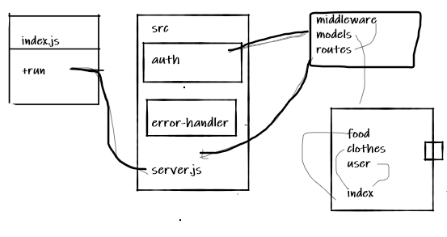

# auth-api

## Links and Resources:
 ### Heroku:

https://mahmoud-auth-api.herokuapp.com/


* ### Github Actions:

https://github.com/Mahmoud-Khader/auth-api/actions


* ### pull request :
https://github.com/Mahmoud-Khader/auth-api/pull/1


## Setup 
### .env requirements :
* ### PORT=3000
* ### POSTGRESQL_URI
* ### SECRET
* ### NODE_ENV=test


## Dependencies needs to install
* ### npm init -y
* ### npm i dotenv express cors 
* ### npm i -D jest supertest 
* ### npm i sequelize 
* ### npm i sqlite3
* ### npm i pg
* ### npm i morgan
* ### npm i jsonwebtoken
* ### npm i bcrypt
* ### npm i base-64

## To Run the Application
* ### clone the repository
* ### run the command (nodemon)

## How to initialize/run your application (where applicable)

* ### nodemon - node index.js

* ### Endpoints:
    * ### home route (/)
    * ### for create (/signup)
    * ### for login (/signin)
    * ### for get (/users)
    * ### for create(/api/v1/food||clothes)
    * ### for update(/api/v1/food||clothes)
    * ### for delete(/api/v1/food||clothes)

 ## Testing

- Returns Object

```
{
  "username":"name provided",
  "password":"pass",
  "role":[user,admin,editor]
},
{
    "name":"mahmoud",
    "calories":"999",
    "type":"protin"

},
{
    "name":"mahmoud",
    "color":"red",
    "size":"x2"

}
```

### Run tests with :
 * ### npm run test

* UML

